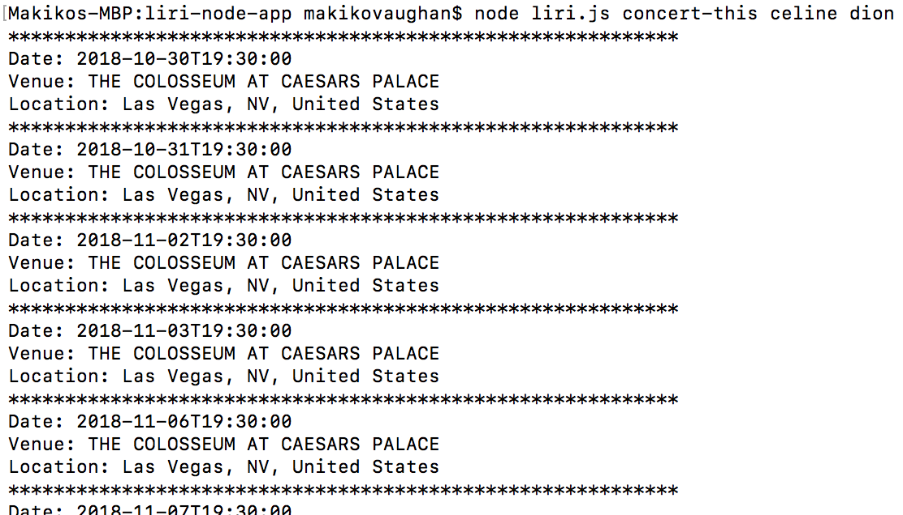
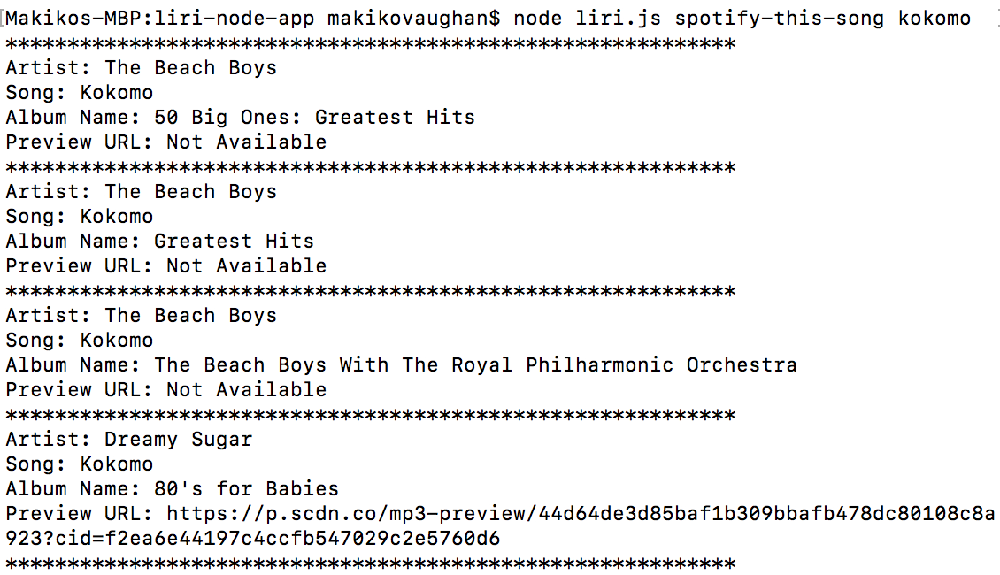
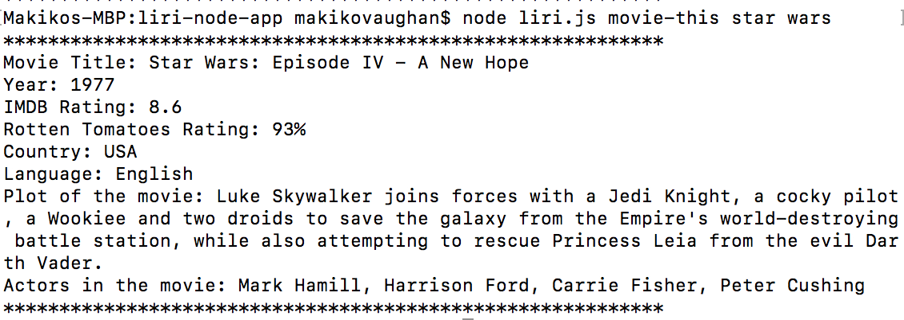
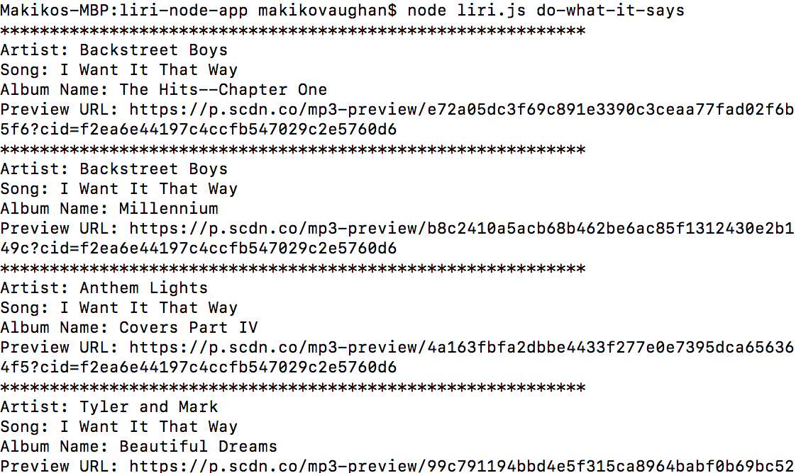

# liri-node-app
--------------------

## Description
Created LIRI that is a language Interpretation and Recognition Interface. 
LIRI is using a command line node to take parameters and returns a requested data.

## Structure of files
-----------------------------

* liri.js: Get the command.

* keys.js: Get the key information for spotify

* .env: The spotify API key

* concert.js: Used bandsintown.com API to get the concert infomation based on the Artist.

* movie.js: Used OMDB API to get the movie information based on the title.

* spotify.js: Used Spotify API to get the information about the music including preview URL based on the song.

* fileCommand.js Get the command from the file(random.txt) instead of a command line.

## How to Use
---------------------------------------

### For getting the concert information.

On a command line, type node liri.js concert-this artist name and hit enter.

### For spotify information

On a command line, type node liri.js spotifty-this-song song title and hit enter.

### For movie information

On a command line, type node liri.js movie-this movie title and hit enter.

### For getting command from file

On a command line, type node liri.js do-what-it-says and hit enter.
Then, the file(random.txt) will be read and return the result.

## Author
--------------------------------------
Makiko Vaughan(makiko.vaughan@gmail.com)